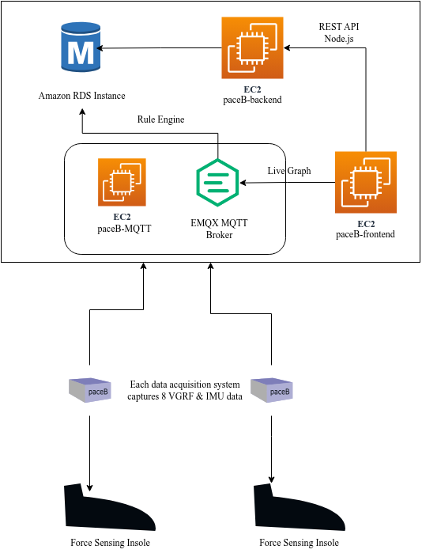
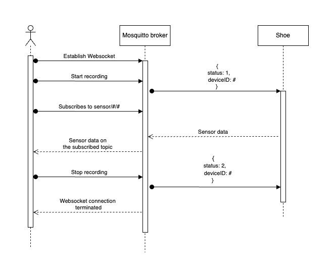
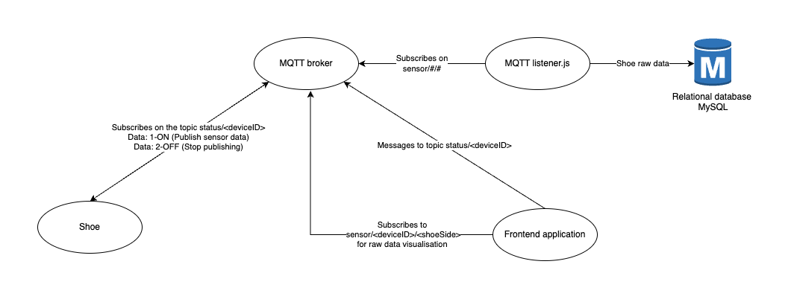

# PaceB application documentation



## API Documentation

<hr>

## Introduction

The EC2 application utilizes the PM2 process manager to run multiple applications concurrently. The following applications are included:

1. **paceB backend - user, patient, device management (Express JS App)**
2. **(i)  Gait (Python Flask Application for Gait Parameter Calculation)**
   **(ii) Report Generator (Python Flask Function for Report PDF Generation)**
   **(iii)Download Raw Data (Python Flask Function)**

This documentation provides an overview of the RESTful API endpoints exposed by the EC2 application and their respective functionalities.

## Iot (Node.js Application)

The Iot application is built using Node.js (v16.17.0) and follows a token-based authentication mechanism using Firebase SDK. It runs on port 5004.

### Endpoints

The root URL for accessing the Iot application is `http://<server_ip>:5004/`.

#### Create a Patient Record

- URL: `/patients`
- Method: `POST`
- Description: Creates a new patient record.
- Request Body:
  ```json
  {
    "doctor_id": "<doctor_id>",
    "patient_name": "<patient_name>",
    "sex": "<gender>",
    "dob": "<date_of_birth>",
    "region": "<patient_region>",
    "age": <patient_age>
  }
  ```
- Response:
  - HTTP Status Code: 200 (OK)
  - Body:
    ```json
    {
      "id": "<patient_id>",
      "doctor_id": "<doctor_id>",
      "patient_name": "<patient_name>",
      "sex": "<gender>",
      "dob": "<date_of_birth>",
      "region": "<patient_region>",
      "age": "<patient_age>",
      "height":"<height>",
      "weight":"<weight>",
      "BMI":"<BMI>",
      "shoesize":"<shoesize>",
      "ehr_patient_id":"<ehr_patient_id>"
    }
    ```
- Error Response:
  - HTTP Status Code: 500 (Internal Server Error)
  - Body:
    ```json
    {
      "error": "<error_message>"
    }
    ```

#### Retrieve Patients by Doctor

- URL: `/patients/:doctor_id`
- Method: `GET`
- Description: Retrieves all patients associated with a specific doctor.
- Path Parameter:
  - `doctor_id`: The ID of the doctor.
- Response:
  - HTTP Status Code: 200 (OK)
  - Body:
    ```json
    [
      {
        "id": "<patient_id>",
        "doctor_id": "<doctor_id>",
        "patient_name": "<patient_name>",
        "sex": "<gender>",
        "dob": "<date_of_birth>",
        "region": "<patient_region>",
        "age": <patient_age>
      },
      ...
    ]
    ```
- Error Response:
  - HTTP Status Code: 500 (Internal Server Error)
  - Body:
    ```json
    {
      "error": "<error_message>"
    }
    ```
#### Transaction History
### Create Razorpay Order

- **URL:** `/orders`
- **Method:** `POST`
- **Description:** Creates a new Razorpay order for transactions.
- **Request Headers:**
  - `subscription` (0 or 1): Indicates whether the doctor is subscribed (1) or not (0).
  - `quantity`: Number of analyses purchased.
  - `subscriptionmonths`: Number of subscription months (if subscribed).
  - `doctor_id`: ID of the associated doctor.
- **Response:**
  - **HTTP Status Code:** 200 (OK)
  - **Body:**
    ```json
    {
      "data": {
        "id": "<order_id>",
        "amount": "<total_amount_in_paise>",
        "currency": "INR",
        "receipt": "<random_receipt_hex>",
        // Additional order details
      }
    }
    ```
  - **Error Response:**
    - **HTTP Status Code:** 500 (Internal Server Error)
    - **Body:**
      ```json
      {
        "error": "<error_message>"
      }
      ```

### Verify Razorpay Payment

- **URL:** `/verify`
- **Method:** `POST`
- **Description:** Verifies a Razorpay payment and updates the doctor's information and transaction history.
- **Request Headers:**
  - `subscription` (0 or 1): Indicates whether the doctor is subscribed (1) or not (0).
  - `doctor_id`: ID of the associated doctor.
- **Request Body:**
  ```json
  {
    "razorpay_order_id": "<order_id>",
    "razorpay_payment_id": "<payment_id>",
    "razorpay_signature": "<payment_signature>"
  }
- **Response Body:**
  ```json
  {
    "message": "Payment verified successfully",
    
  }
### Get All Transactions

- **URL:** `/getAllTransactions`
- **Method:** `GET`
- **Description:** Retrieves all transaction history for a specific doctor.
- **Request Headers:**
  - `doctor_id`: ID of the associated doctor.
- **Response:**
  - **HTTP Status Code:** 200 (OK)
  - **Body:**
    ```json
    {
      "data": [
        {
          // Transaction details
        },
        // Additional transactions
      ]
    }
    ```
  - **Error Response:**
    - **HTTP Status Code:** 404 (Not Found)
      - **Body:**
        ```json
        {
          "error": "Transactions not found"
        }
        ```
    - **HTTP Status Code:** 500 (Internal Server Error)
      - **Body:**
        ```json
        {
          "error": "Internal Server Error!"
        }
        ```
#### Doctors
The `/doctors` endpoint allows creating and retrieving doctor's records.

### Update Invoice Details

- **URL:** `/updateInvoiceDetails`
- **Method:** `POST`
- **Description:** Updates invoice details for a specific doctor.
- **Request Body:**
  ```json
  {
    "doctor_id": "<doctor_id>",
    "doctor_name": "<doctor_name>",
    "doctor_email": "<doctor_email>",
    "institution_address": "<institution_address>",
    "gst_number": "<gst_number>"
  }
- **Response:**
  - **HTTP Status Code:** 200 (OK)
  - **Body:**
    ```json
    {
        "message": "Invoice Details Updated"
    }
    ```
  - **Error Response:**
    - **HTTP Status Code:** 404 (Not Found)
      - **Body:**
        ```json
        {
          "error": "Doctor not found"
        }
        ```
    - **HTTP Status Code:** 500 (Internal Server Error)
      - **Body:**
        ```json
        {
          "error": "Internal Server Error!"
        }
        ```
### Check Profile Details Updated

- **URL:** `/checkProfileDetailsUpdated`
- **Method:** `GET`
- **Description:** Checks if profile details are updated for a specific doctor.
- **Request Headers:**
  - `doctor_id`: ID of the associated doctor.
- **Response:**
  - **HTTP Status Code:** 200 (OK)
  - **Body:**
    ```json
    {
      "updated": true
    }
    ```
  - **Error Response:**
    - **HTTP Status Code:** 404 (Not Found)
      - **Body:**
        ```json
        {
          "error": "Doctor not found"
        }
        ```
    - **HTTP Status Code:** 500 (Internal Server Error)
      - **Body:**
        ```json
        {
          "error": "Internal Server Error"
        }
        ```
### Get Doctor Analysis Details

- **URL:** `/noanalysis`
- **Method:** `GET`
- **Description:** Retrieves analysis details for a specific doctor.
- **Request Headers:**
  - `doctor_id`: ID of the associated doctor.
  - `doctor_email`: Email of the associated doctor.
- **Response:**
  - **HTTP Status Code:** 200 (OK)
  - **Body:**
    ```json
    {
      "noAnalysis": 0,
      "subscription": false,
      "subs_expiry": null
    }
    ```
  - **Error Response:**
    - **HTTP Status Code:** 404 (Not Found)
      - **Body:**
        ```json
        {
          "error": "Doctor not found"
        }
        ```
    - **HTTP Status Code:** 500 (Internal Server Error)
      - **Body:**
        ```json
        {
          "error": "Internal Server Error"
        }
        ```
### Reduce Doctor Analysis Count

- **URL:** `/reduceAnalysis`
- **Method:** `PUT`
- **Description:** Reduces the analysis count for a specific doctor.
- **Request Headers:**
  - `doctor_id`: ID of the associated doctor.
- **Response:**
  - **HTTP Status Code:** 200 (OK)
  - **Body:**
    ```json
    {
      "noAnalysis": 0
    }
    ```
  - **Error Response:**
    - **HTTP Status Code:** 500 (Internal Server Error)
      - **Body:**
        ```json
        {
          "error": "Doctor not found"
        }
        ```
### Change Payment Scheme

- **URL:** `/changePayScheme`
- **Method:** `PUT`
- **Description:** Changes the payment scheme (subscription/analysis) for a specific doctor.
- **Request Headers:**
  - `doctor_id`: ID of the associated doctor.
  - `subscription`: Subscription status (0 or 1).
- **Response:**
  - **HTTP Status Code:** 200 (OK)
  - **Body:**
    ```json
    {
      "noAnalysis": 0,
      "subscription": false,
      "subs_expiry": null
    }
    ```
  - **Error Response:**
    - **HTTP Status Code:** 500 (Internal Server Error)
      - **Body:**
        ```json
        {
          "error": "Internal Server Error"
        }
        ```
### Edit Doctor Profile

- **URL:** `/editDocProfile`
- **Method:** `PUT`
- **Description:** Edits the profile details for a specific doctor.
- **Request Headers:**
  - `doctor_id`: ID of the associated doctor.
- **Request Body:**
  ```json
  {
    "doctor_name": "<new_doctor_name>",
    "doctor_email": "<new_doctor_email>",
    "institution_address": "<new_institution_address>",
    "gst_number": "<new_gst_number>"
  }
- **Response Body:**
  - **HTTP Status Code:** 200 (OK)
  - **Body:**
    ```json
    {
      "message": "Invoice details updated"
    }
    ```
 - **Error Response:**
    - **HTTP Status Code:** 500 (Internal Server Error)
      - **Body:**
        ```json
        {
          "error": "Internal Server Error"
        }
        ```
### Get Doctor Profile

- **URL:** `/getDocProfile`
- **Method:** `GET`
- **Description:** Retrieves the profile details for a specific doctor.
- **Request Headers:**
  - `doctor_id`: ID of the associated doctor.
- **Response:**
  - **HTTP Status Code:** 200 (OK)
  - **Body:**
    ```json
    {
      "doctor_name": "<doctor_name>",
      "doctor_email": "<doctor_email>",
      "institution_address": "<institution_address>",
      "gst_number": "<gst_number>"
    }
    ```
  - **Error Response:**
    - **HTTP Status Code:** 404 (Not Found)
      - **Body:**
        ```json
        {
          "error": "Doctor not found"
        }
        ```
    - **HTTP Status Code:** 500 (Internal Server Error)
      - **Body:**
        ```json
        {
          "error": "Internal Server Error"
        }
        ```

#### Medical History

The `/medicalHistory` endpoint allows creating and retrieving medical history records.

##### Create a Medical History Record

- URL: `/medicalHistory`
- Method: `POST`
- Description: Creates a new medical history record.
- Request Body:
  ```json
  {
    "patient_condition": "<condition>",
    "patient_symptom": "<symptom>",
    "patientId": "<patient_id>"
  }
  ```
- Response:

  - HTTP Status Code: 200 (OK)
  - Body:

    ```json
    {
      "id": "<record_id>",
      "patient_condition": "<condition>",
      "patient_symptom": "<symptom>",
      "patientId": "<patient_id>"
    }

    - Error Response:
    ```

  - HTTP Status Code: 500 (Internal Server Error)
  - Body:
    ```json
    {
      "error": "<error_message>"
    }
    ```
### Update Medical History Record

- **URL:** `/`
- **Method:** `PUT`
- **Description:** Updates a medical history record.
- **Request:**
  - **Method:** `PUT`
  - **Body:**
    ```json
    {
      "id": "<medical_history_id>",
      "condition": "<new_condition>",
      "notes": "<new_notes>"
    }
    ```
- **Response:**
  - **HTTP Status Code:** 200 (OK)
  - **Body:**
    ```json
    {
      "message": "Medical history records updated successfully"
    }
    ```

- **Error Response:**
  - **HTTP Status Code:** 500 (Internal Server Error)
    - **Body:**
      ```json
      {
        "error": "Internal Server Error"
      }
      ```
### Get Medical History Records by Recording ID

- **URL:** `/MedRecord/:rid`
- **Method:** `GET`
- **Description:** Retrieves medical history records based on the recording ID.
- **Request:**
  - **Method:** `GET`
  - **Parameters:**
    - `rid` (Recording ID)
- **Response:**
  - **HTTP Status Code:** 200 (OK)
  - **Body:**
    ```json
    [
      {
        // Medical history record data
      },
      // Additional records if any
    ]
    ```

- **Error Response:**
  - **HTTP Status Code:** 500 (Internal Server Error)
    - **Body:**
      ```json
      {
        "error": "Internal Server Error"
      }
      ```
### Delete Medical History Record by ID

- **URL:** `/:medHistoryId`
- **Method:** `DELETE`
- **Description:** Deletes a medical history record and its related shoeRawData records by ID.
- **Request:**
  - **Method:** `DELETE`
  - **Parameters:**
    - `medHistoryId` (Medical History Record ID)
- **Response:**
  - **HTTP Status Code:** 200 (OK)
  - **Body:**
    ```json
    {
      "message": "Medical history record and related shoeRawData records deleted successfully"
    }
    ```

- **Error Response:**
  - **HTTP Status Code:** 404 (Not Found)
    - **Body:**
      ```json
      {
        "error": "Medical history record not found"
      }
      ```
  - **HTTP Status Code:** 500 (Internal Server Error)
    - **Body:**
      ```json
      {
        "error": "Internal Server Error"
      }
      ```

##### Retrieve Medical Records by Patient

- URL: `/medicalHistory/:patient_id`
- Method: `GET`
- Description: Retrieves all medical records associated with a specific patient.
- Path Parameter:
  - `patient_id`: The ID of the patient.
- Response:
  - HTTP Status Code: 200 (OK)
  - Body:
    ```json
    {
      "patient": {
        "id": "<patient_id>",
        "doctor_id": "<doctor_id>",
        "patient_name": "<patient_name>",
        "sex": "<gender>",
        "dob": "<date_of_birth>",
        "region": "<patient_region>",
        "age": "<patient_age>",
        "height":"<height>",
        "weight":"<weight>",
        "BMI":"<BMI>",
        "shoesize":"<shoesize>",
        "ehr_patient_id":"<ehr_patient_id>"
      },
      "medical_records": [
        {
          "id": "<record_id>",
          "patient_condition": "<condition>",
          "patient_symptom": "<symptom>",
          "patientId": "<patient_id>"
        },
        ...
      ]
    }
    ```
- Error Response:
  - HTTP Status Code: 500 (Internal Server Error)
  - Body:
    ```json
    {
      "error": "<error_message>"
    }
    ```

#### Shoe Registry

The `/shoeRegistry` endpoint allows managing the association and registration of shoe devices.

##### Associate Shoe with Doctor

- URL: `/shoeRegistry/associate`
- Method: `POST`
- Description: Associates a shoe with a doctor.
- Request Body:
  ```json
  {
    "doctor_id": "<doctor_id>",
    "device_id": "<device_id>"
  }
  ```
- Response:
  - HTTP Status Code: 200 (OK)
  - Body:
    ```json
    {
      "doctor_id": "<doctor_id>",
      "device_id": "<device_id>"
    }
    ```
- Error Response:
  - HTTP Status Code: 500 (Internal Server Error)
  - Body:
    ```json
    {
      "error": "<error_message>"
    }
    ```

##### Register a Shoe Device

- URL: `/shoeRegistry/register`
- Method: `POST`
- Description: Registers a shoe device in the shoe registry.
- Request Body:
  ```json
  {
    "device_id": "<device_id>"
  }
  ```
- Response:
  - HTTP Status Code: 200 (OK)
  - Body:
    ```json
    {
      "device_id": "<device_id>"
    }
    ```
- Error Responses:
  - HTTP Status Code: 500 (Internal Server Error)
  - Body:
    ```json
    {
      "error": "<error_message>"
    }
    ```
  - HTTP Status Code: 403 (Forbidden)
  - Body:
    ```json
    {
      "message": "Device already registered"
    }
    ```

##### Get Unassociated Shoes

- URL: `/shoeRegistry/`
- Method: `GET`
- Description: Retrieves all shoes that are not associated with a doctor.
- Response:
  - HTTP Status Code: 200 (OK)
  - Body:
    ```json
    [
      {
        "device_id": "<device_id>"
      },
      ...
    ]
    ```
- Error Response:
  - HTTP Status Code: 500 (Internal Server Error)
  - Body:
    ```json
    {
      "error": "<error_message>"
    }
    ```

##### Get Associated Shoes by Doctor

- URL: `/shoeRegistry/:doctor_id`
- Method: `GET`
- Description: Retrieves all shoes associated with a specific doctor.
- Path Parameter:
  - `doctor_id`: The ID of the doctor.
- Response:
  - HTTP Status Code: 200 (OK

)

- Body:
  ```json
  [
    {
      "doctor_id": "<doctor_id>",
      "device_id": "<device_id>"
    },
    ...
  ]
  ```
- Error Response:
  - HTTP Status Code: 500 (Internal Server Error)
  - Body:
    ```json
    {
      "error": "<error_message>"
    }
    ```

#### Set Shoe State

The `/setShoeState` endpoint allows updating the recording state of a medical history record ans turs the shoe ON/OFF, STATE: 1-ON, 0-OFF.

##### Update Recording State

- URL: `/setShoeState/`
- Method: `POST`
- Description: Updates the recording state of a medical history record.
- Request Body:
  ```json
  {
    "id": "<record_id>",
    "state": "<state>",
    "recording_id": "<recording_id>"
  }
  ```
- Response:
  - HTTP Status Code: 200 (OK)
  - Body:
    ```json
    {
      "id": "<record_id>",
      "state": "<state>",
      "recording_id": "<recording_id>"
    }
    ```
- Error Response:
  - HTTP Status Code: 500 (Internal Server Error)
  - Body:
    ```json
    {
      "error": "<error_message>"
    }
    ```

<br>

## EMQX Broker Documentation (As of Dec 17th, 2023 we are using evaluation version of EMQX hosted on an EC2 instance paceB-MQTT)

<hr>

The EMQX broker facilitates communication using the MQTT. The broker captures data from the data acquisition system published on the topic `/sensor/#/#` and forwards the data to a rule engine which is configured to insert the data in the shoeRawData table of paceBdb. 

- Move to the side navigation bar after logging in to http://mqtt.bearlytech.com:18083/#/login?to=/dashboard/nodes using the credentials username : "admin" and password: "bearly@emqx"
- Find the Integration dropdown and click on Rules 
- Rule ID rule_qmvh subscribes to the topic `/sensor/#` and implements the following action
```plaintext
SELECT
  payload.time AS time,
  payload.Battery_percentage AS Battery_percentage,
  payload.device_id AS device_id,
  payload.shoe_side AS shoe_side,
  payload.recording_id as recording_id,
  payload.vout1 AS vout1,
  payload.vout2 AS vout2,
  payload.vout3 AS vout3,
  payload.vout4 as vout4,
  payload.vout5 AS vout5,
  payload.vout6 AS vout6,
  payload.vout7 AS vout7,
  payload.vout8 AS vout8,
  payload.xaccel AS xaccel
  
FROM
  "sensor/#"
```

- This configuration sets up listeners on 8883 for ssl, 1883 for tcp, 8083 for websockets, 8084 for websockets secure and 18083 for the dashboard
- The data acquisition system uses default 1883 port over tcp with a username:"dasarathg68" password:"bearly@emqx" to publish data to the broker while the frontend websocket connections are forwarded through port 443 of the URL wss://mqtt.bearlytech.com with path '/mqtt' to the default 8083 websockets port. 
- Renew the certificates once every 89 days using the commands mentioned below (1st one for checking status, 2nd for renewal)
```plaintext
sudo certbot certficates
sudo certbot renew --force-renewal
```

## Data Capture and Organisation

<hr>

The captured data is stored in an RDS (Relational Database Service) database. A `recording ID ` is generated from the frontend and associated with the captured data before being stored in the RDS database.

<br>
<br>

# Database Schema Documentation

The schema consists of four tables: `medicalHistories`, `patients`, `shoeRawData`, and `shoeRegistries`. The structure and details of each table are described below.

#### medicalHistories Table

```plaintext
+-------------------+--------------+------+-----+---------+----------------+
| Field             | Type         | Null | Key | Default | Extra          |
+-------------------+--------------+------+-----+---------+----------------+
| id                | int          | NO   | PRI | NULL    | auto_increment |
| patient_condition | varchar(255) | YES  |     | NULL    |                |
| patient_symptom   | varchar(255) | YES  |     | NULL    |                |
| recording_id      | varchar(255) | YES  |     | NULL    |                |
| createdAt         | datetime     | NO   |     | NULL    |                |
| updatedAt         | datetime     | NO   |     | NULL    |                |
| patientId         | int          | YES  | MUL | NULL    |                |
+-------------------+--------------+------+-----+---------+----------------+
```

- `medicalHistories` table stores medical histories associated with patients.
- The `id` field is an auto-incrementing primary key.
- `patient_condition` and `patient_symptom` fields store the condition and symptom of the patient, respectively.
- `recording_id` field stores the recording ID associated with the medical history.
- `createdAt` and `updatedAt` fields store the creation and update timestamps.
- `patientId` field references the `id` field of the `patients` table.

#### patients Table

```plaintext
+--------------+-----------------------+------+-----+---------+----------------+
| Field        | Type                  | Null | Key | Default | Extra          |
+--------------+-----------------------+------+-----+---------+----------------+
| id           | int                   | NO   | PRI | NULL    | auto_increment |
| doctor_id    | varchar(255)          | NO   |     | NULL    |                |
| patient_name | varchar(255)          | NO   |     | NULL    |                |
| sex          | enum('M','F','T','O') | NO   |     | NULL    |                |
| dob          | datetime              | NO   |     | NULL    |                |
| region       | int                   | NO   |     | NULL    |                |
| age          | int                   | NO   |     | NULL    |                |
| createdAt    | datetime              | NO   |     | NULL    |                |
| updatedAt    | datetime              | NO   |     | NULL    |                |
+--------------+-----------------------+------+-----+---------+----------------+
```

- `patients` table stores information about patients.
- The `id` field is an auto-incrementing primary key.
- `doctor_id` field stores the ID of the associated doctor.
- `patient_name` field stores the name of the patient.
- `sex` field stores the gender of the patient (`M` for male, `F` for female, `T` for transgender, `O` for other).
- `dob` field stores the date of birth of the patient.
- `region` field stores the region of the patient's location.
- `age` field stores the age of the patient.
- `createdAt` and `updatedAt` fields store the creation and update timestamps.

### doctors Table

| Field                | Type         | Null | Key | Default | Extra          |
|----------------------|--------------|------|-----|---------|----------------|
| doctor_id (Primary)  | varchar(255) | NO   |     | NULL    |                |
| no_analysis          | int          | NO   |     | NULL    |                |
| subscription         | boolean      | NO   |     | NULL    |                |
| subs_expiry          | date         | YES  |     | NULL    |                |
| doctor_name          | varchar(255) | YES  |     | NULL    |                |
| doctor_email         | varchar(255) | YES  |     | NULL    |                |
| institution_address  | varchar(255) | YES  |     | NULL    |                |
| gst_number           | varchar(255) | YES  |     | NULL    |                |
| createdAt (Timestamp)| datetime     | NO   |     | NULL    |                |
| updatedAt (Timestamp)| datetime     | NO   |     | NULL    |                |

- **doctor_id (Primary Key):**
  - Type: varchar(255)
  - Description: Unique identifier for the doctor.
  - Constraints: Must not be null, and should not be empty.

- **no_analysis:**
  - Type: int
  - Description: Number of analyses associated with the doctor.
  - Constraints: Must not be null, and should not be empty.

- **subscription:**
  - Type: boolean
  - Description: Indicates whether the doctor has an active subscription.
  - Constraints: Must not be null, and should not be empty.

- **subs_expiry:**
  - Type: date
  - Description: Expiry date of the subscription, if applicable.
  - Constraints: Can be null.

- **doctor_name:**
  - Type: varchar(255)
  - Description: Name of the doctor.
  - Constraints: Can be null.

- **doctor_email:**
  - Type: varchar(255)
  - Description: Email address of the doctor.
  - Constraints: Can be null.

- **institution_address:**
  - Type: varchar(255)
  - Description: Address of the institution associated with the doctor.
  - Constraints: Can be null.

- **gst_number:**
  - Type: varchar(255)
  - Description: GST number associated with the doctor.
  - Constraints: Can be null.

- **createdAt (Timestamp):**
  - Type: datetime
  - Description: Timestamp indicating the creation time of the record.

- **updatedAt (Timestamp):**
  - Type: datetime
  - Description: Timestamp indicating the last update time of the record.

- **Table Name:**
  - doctor

- **Additional Information:**
  - The table stores information about doctors, including their unique identifier, the number of analyses, subscription status, subscription expiry date, name, email, institution address, GST number, and timestamps of creation and updates.

#### transactionHistory table

| Field                 | Type          | Null | Key | Default          | Extra               |
|-----------------------|---------------|------|-----|------------------|---------------------|
| id                    | int           | NO   | PRI | NULL             | auto_increment      |
| razorpay_order_id     | varchar(255)  | YES  |     | NULL             |                     |
| razorpay_payment_id   | varchar(255)  | YES  |     | NULL             |                     |
| subscription          | boolean       | YES  |     | NULL             |                     |
| doctor_id             | varchar(255)  | YES  |     | NULL             |                     |
| subscriptionMonths    | int           | YES  |     | NULL             |                     |
| analysis_purchased    | int           | YES  |     | NULL             |                     |
| amount                | float         | YES  |     | NULL             |                     |
| createdAt             | datetime      | NO   |     | NULL             |                     |
| updatedAt             | datetime      | NO   |     | NULL             |                     |

- **id (Primary Key):**
  - Type: int
  - Description: Auto-incrementing primary key.

- **razorpay_order_id:**
  - Type: varchar(255)
  - Description: Stores the Razorpay order ID for the transaction.

- **razorpay_payment_id:**
  - Type: varchar(255)
  - Description: Stores the Razorpay payment ID for the transaction.

- **subscription:**
  - Type: boolean
  - Description: Indicates whether the purchase type is subscription or analysis.

- **doctor_id:**
  - Type: varchar(255)
  - Description: Stores the ID of the associated doctor.

- **subscriptionMonths:**
  - Type: int
  - Description: Stores the number of subscription months, if applicable.

- **analysis_purchased:**
  - Type: int
  - Description: Stores the number of analyses purchased.

- **amount:**
  - Type: float
  - Description: Stores the transaction amount.

- **createdAt:**
  - Type: datetime
  - Description: Timestamp indicating the creation time of the record.

- **updatedAt:**
  - Type: datetime
  - Description: Timestamp indicating the last update time of the record.


#### shoeRawData Table

```plaintext
+--------------+--------------+------+-----+---------+----------------+
| Field        | Type         | Null | Key | Default | Extra          |
+--------------+--------------+------+-----+---------+----------------+
| id           | int          | NO   | PRI | NULL    | auto_increment |
| time         | varchar(255) | NO   |     | NULL    |                |
| batt_percent | varchar(255) | NO   |     | NULL    |                |
| recording_id | varchar(255) | NO   |     | NULL    |                |
| shoe_side    | varchar(255) | NO   |     | NULL    |                |
| device_id    | varchar(255) | NO   |     | NULL    |                |
| vout1        | varchar(255) | NO   |     | NULL    |                |
| vout2        | varchar(255) | NO   |     | NULL    |                |
| vout3        | varchar(255) | NO   |     | NULL    |                |
| vout4        | varchar(255) | NO   |     | NULL    |                |
| vout5        | varchar(255) | NO   |     | NULL    |                |
| vout6        | varchar(255) | NO   |     | NULL    |                |
| vout7        | varchar(255) | NO   |     | NULL    |                |
| vout8        | varchar(255) | NO   |     | NULL    |                |
| speed        | varchar(255) | NO   |     | NULL    |                |
+--------------+--------------+------+-----+---------+----------------+
```

- `shoeRawData` table stores raw data captured from a gait analysis shoe.
- The `id` field is an auto-incrementing primary key.
- `time` field stores the time of the captured data.
- `batt_percent` field stores the battery percentage.
- `recording_id` field stores the recording ID associated with the captured data.
- `shoe_side` field stores the side of the shoe.
- `device_id` field stores the ID of the device.
- `vout1` to `vout8` fields store specific voltage readings.
- `speed` field stores the speed value.

#### shoeRegistries Table

```plaintext
+-----------+--------------+------+-----+---------+----------------+
| Field     | Type         | Null | Key | Default | Extra          |
+-----------+--------------+------+-----+---------+----------------+
| id        | int          | NO   | PRI | NULL    | auto_increment |
| doctor_id | varchar(255) | YES  |     | NULL    |                |
| device_id | varchar(255) | YES  | UNI | NULL    |                |
| createdAt | datetime     | NO   |     | NULL    |                |
| updatedAt | datetime     | NO   |     | NULL    |                |
+-----------+--------------+------+-----+---------+----------------+
```

- `shoeRegistries` table stores information about registered shoes.
- The `id` field is an auto-incrementing primary key.
- `doctor_id` field stores the ID of the associated doctor.
- `device_id` field stores the ID of the shoe device. It is unique (`UNI` key constraint).
- `createdAt` and `updatedAt` fields store the creation and update timestamps.

<br>

# Data Flow Documentation: Recording Sensor Data via MQTT



1. User Interaction:

   - The user initiates the recording process by pressing the "Start Recording" button on the frontend application.

2. Frontend Application Connection:

   - The frontend application establishes a WebSocket connection with the EMQX broker, enabling real-time communication.

3. Start Recording Message:

   - The frontend application publishes a message on the topic "status/#" to trigger the start of data recording.
   - The "#" in the topic represents the selected shoe ID, specified by the doctor.
   - The message contains the device ID and its state (e.g., "start recording").

4. Device Activation:
   - Upon receiving the start recording message, the gait analysis device (shoe) associated with the selected ID activates and begins collecting sensor data.
   - The device posts its sensor data to the topic "sensor/#/#".
   - The first "#" in the topic represents the device ID, and the second "#" represents the shoe side (left or right).
   - Each data message includes the device ID, shoe side, and the provided recording ID.



5. Recording ID Message:

   - The device publishes a message/packet on the topic, including the recording ID it generated.
    ```json
      {"time":"90458",
      "Battery_percentage":-391,
      "device_id":"A1A1T",
      "shoe_side":"right",
      "recording_id":"xrHGoQ1KG",
      "vout1":145.4516144,"vout2":154.4838715,
      "vout3":0,"vout4":0,"vout5":0,"vout6":0,
      "vout7":0,"vout8":136.2903137}
   ```
   - This packet helps in associating the subsequent sensor data with the specific recording ID.
 

6. Sensor Data Capture and Storage:

   - The MQTT listener receives the sensor data messages posted by the device on the "sensor/#/#" topic.
   - The listener extracts the recording ID, device ID, shoe side, and other sensor data values from each message.
   - The EMQX broker hosted on http://mqtt.bearlytech.com:18083/#/dashboard/overview has a built in rule engine which is configured to forward the incoming data streams to a table "shoeRawData", using the received recording ID to maintain the data's association in MySQL RDS database paceBdb.

8. Frontend Graph Component Subscription:

   - The frontend application's graph component subscribes to the topic "sensor/#/#" based on the selected shoe and shoe side.
   - This subscription enables the graph component to receive real-time sensor data updates from the MQTT broker.

9. Stop Recording Message:

   - When the user decides to stop the recording, the frontend application publishes a message on the "status/#" topic.
   - This message indicates the recording's end and contains a state number (e.g., 2 representing the "off" state).

10. Device Deactivation:
    - Upon receiving the stop recording message, the gait analysis device (shoe) associated with the selected ID deactivates and stops collecting sensor data.

<br>

# Invoice generation

### Download Invoice

- **URL:** `/gait/invoice/`
- **Methods:** `GET`, `POST`
- **Description:** Downloads the invoice for a transaction.
- **Request:**
  - **Method:** `POST`
  - **Body:**
    ```json
    {
      "payment_id": "<razorpay_payment_id>",
      "doctor_id": "<doctor_id>"
    }
    ```
- **Response:**
  - **HTTP Status Code:** 200 (OK)
  - **Headers:**
    - `Content-Type: application/pdf`
    - `Content-Disposition: inline; filename=output.pdf`
  - **Body:** PDF file containing the invoice for the specified transaction.

- **Error Response:**
  - **HTTP Status Code:** 500 (Internal Server Error)
    - **Body:**
      ```json
      {
        "error": "Internal Server Error"
      }
      ```


# PDF Generation

The application uses the Flask framework and PDFKit library to render HTML templates and convert them to PDF files. The API endpoint `/download` is responsible for generating and serving the PDF report.

### Endpoint: `/download`

- Method: GET, POST
- Description: Generates and downloads a PDF report based on the provided data.
- Request Payload:
  - Content-Type: application/json
  - Body: JSON object containing the following data:
    - `patientId` (integer): ID of the patient to generate the report for.
    - `gaitData` (object): Gait analysis data in JSON format.
- Response:
  - Content-Type: application/pdf
  - Content-Disposition: inline; filename=output.pdf

#### Request Example:

```bash
curl -X POST -H "Content-Type: application/json" -d '{
  "patientId": 123,
  "gaitData": {
    "AverageForceApplied": {
      "left": 266.1249949385,
      "right": 190.959672511375
    },
    "Cadence": {
      "left": 252.63157894736844,
      "right": 186.33540372670808
    },
    ...
  }
}'
```

#### Response Example:

The response will be a PDF file that can be downloaded and viewed by the client.

#### Error Responses:

- Status: 400 Bad Request
  - Description: Invalid request payload or missing required data.


### HTML Template:

The PDF report is generated by rendering an HTML template named "report.html". This template uses Jinja2 templating engine to dynamically populate the patient information and medical history data.

### CORS Support:

The application includes CORS (Cross-Origin Resource Sharing) support using the Flask-CORS extension. This allows cross-origin requests to be made to the `/download` endpoint.

### Taking backup:
Go to EC2 instance with tag "paceB-Backend". As of Jan 19,2024, we use mysqldump command to dump the structure and data to a .sql file and push it to a remote repository named "databackup". Password is Asdfgh2014$$
```plaintext
cd databackup
```
```plaintext
mysqldump -u admin -h paceb.ch7qblmju1la.ap-south-1.rds.amazonaws.com paceBdb > usefilename.sql -p
```
```plaintext
git add .
git commit -m "maybe the date or anything that makes sense"
git push
```
Now, pull changes to your local machine and import the .sql file using MySQLWorkbench and start developing.
